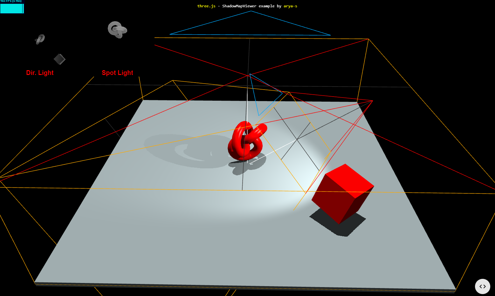

# portfolio-page
My portfolio website, built with three.js.

## Ideas
Navigate between pages in a 3d space, pages should have a representative geometry, with a flat surface to zoom the camera to when clicked to display a webpage with the work from the associated project or job.

An example of the sort of [3d environment](https://threejs.org/examples/#webgl_shadowmap_viewer) I want.



Look for inspiration for what to include from other people's websites. On a first investigation, I liked [Adam Alston's](https://www.adamalston.com/), [Bowang Lan's](https://bowanglan.dev/), [Ed H's](https://www.edwardh.io/), [Jesse Zhou's](https://jesse-zhou.com/), and [Simon Bruno's](https://bruno-simon.com/) portfolio pages.

## Editing
For editing, use npm to install threejs and vite from a terminal in the project directory.
```
npm install --save three     # three.js
npm install --save-dev vite  # vite
```
View the website for development purposes with vite by simply calling `npx vite` from a terminal. The production build of the site can be previewed using the npm script `local-test`. 
```
npm run local-test
```

## Hosting
The site is hosted on CloudFlare, running the `build` script every time a change is pushed to the main branch.